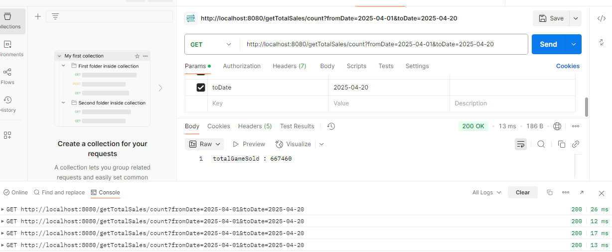
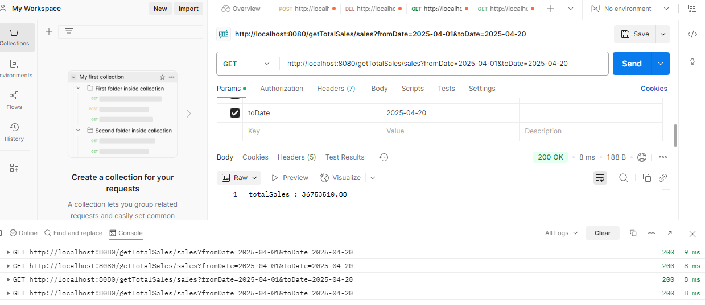

#Requirements
* Java 17 or newer
* Postman App(Testing of Api)

#Getting Started
* mySql create 2 tables
using the provided scripts in the resource folder
1. createGame_sales_summary.sql 
2. createGamesSales.sql (Task 1)

#Generate csv file to your local disk
Go to test folder  -> java -> com.example.demo -> GenerateCsvFile.java
Change directory below to save your csv file location.
```sh
String filePath = "C:/temp/vanguard/src/main/resources/import1.csv";
```
After that run this java class to generate the csv file to your filePath

#Configure Setup on application.properties
```sh
spring.datasource.url=jdbc:mysql://localhost:3306/test?rewriteBatchedStatements=true
spring.datasource.username=root
spring.datasource.password=
spring.datasource.driver-class-name=com.mysql.cj.jdbc.Driver
spring.cronjob.seconds=1
```

#Once Setup finished , run springBoot
go to main folder -> java -> com.example.demo -> Run VanguardApplication

#Import the Csv file (Use Postman app - Task 5)
In postman app , select POST method paste url : 
http://localhost:8080/csv/import
and under "Key" column type "file" . 
In the middle drop down menu ,change to "File".
Under the "Value" column browse to the generated Csv file location and press "Send" button


#Optional (Api delete database on table game_sales - DELETE method)
In postman app , select DELETE method paste url : 
http://localhost:8080/csv/delete
and click "Send" button

#Testing Api Task 3 (Use Postman app - GET method)
http://localhost:8080/getGameSales?page=5&size=100

http://localhost:8080/getGameSales/byDate?fromDate=2025-04-01&toDate=2025-04-02&page=5&size=100

http://localhost:8080/getGameSales/byPrice?price=50&operator=<&page=5&size=100


#Testing Api Task 4 (Use Postman app - GET method)
http://localhost:8080/getTotalSales/count?fromDate=2025-04-01&toDate=2025-04-20

http://localhost:8080/getTotalSales/sales?fromDate=2025-04-01&toDate=2025-04-20

http://localhost:8080/getTotalSales/salesByGameNo?gameNo=3&fromDate=2025-04-01&toDate=2025-04-30

